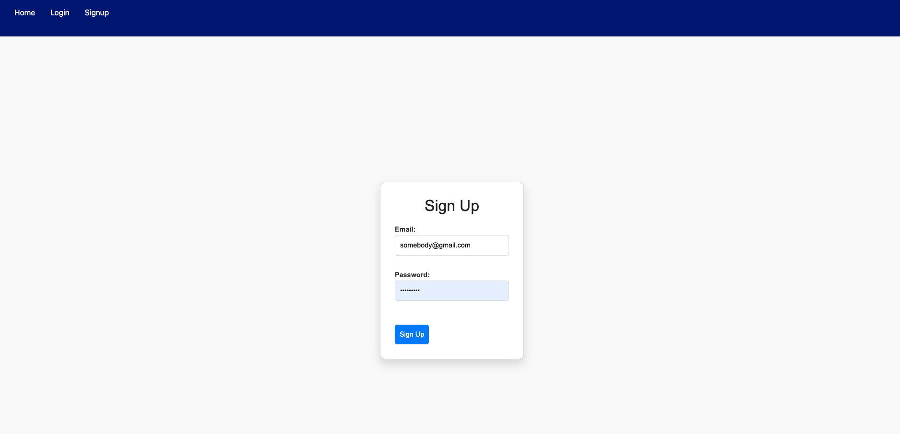
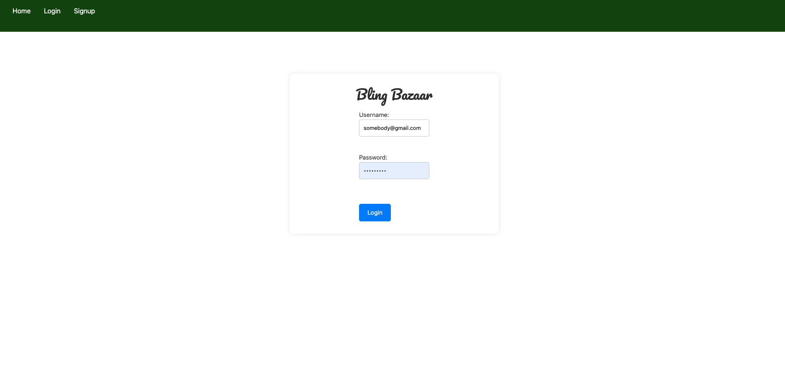
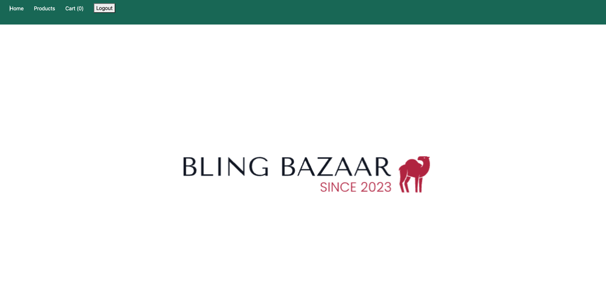
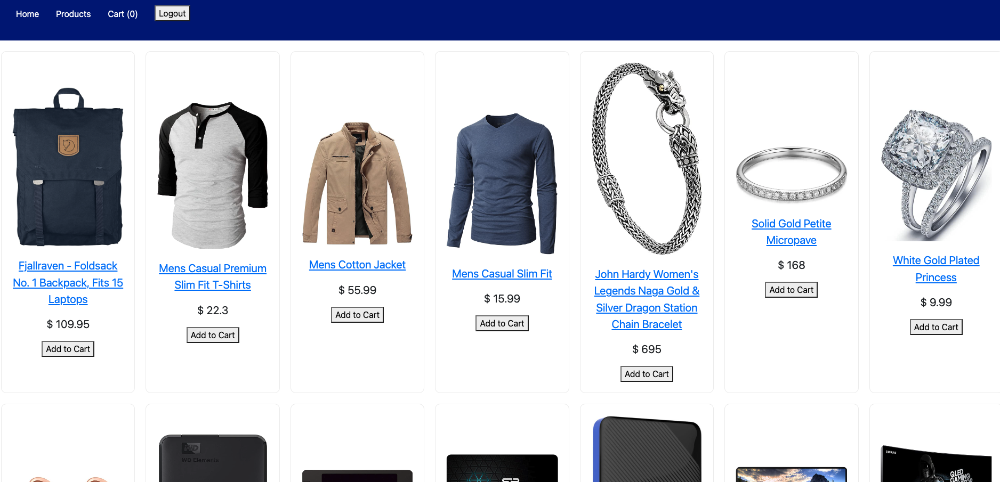
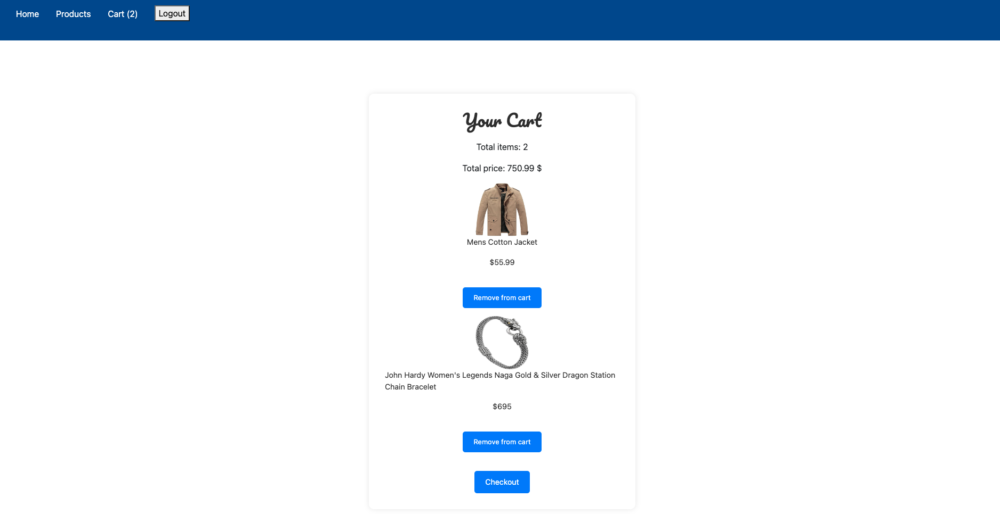
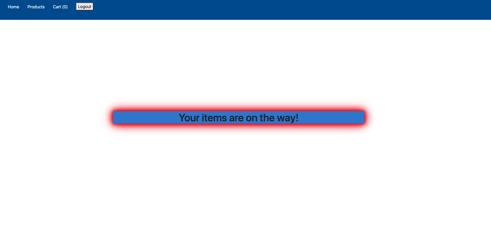

# **Bling Bazaar**

## Overview
### Bling Bazaar is an online e-commerce store that provides customers access to a diverse array of trendy products. It utilizes the fakestore API to 
### render different products on screen for users to select from. This app allows users to create a profile, add products to their cart, and checkout.

## Screenshots 
### Main Page (Pre-login)

### Sign Up Page

### Login Page

### Main Page (Post-login)

### Products Page

### Cart Page

### Checkout Page

## Technologies used
- Javascript
- HTML
- CSS

## Getting started
- link to deployed app: 
- link to trello board: https://trello.com/b/LOMbhuyY/project4-ecommerce-app

## Planned future enhancements
- Would like to implement EmailJS (or another client-side library) that sends the user an email notification after they order products from the site
- Add more products to the site (perhaps by finding another API) as the number of products the Fake store API prodices is limited
